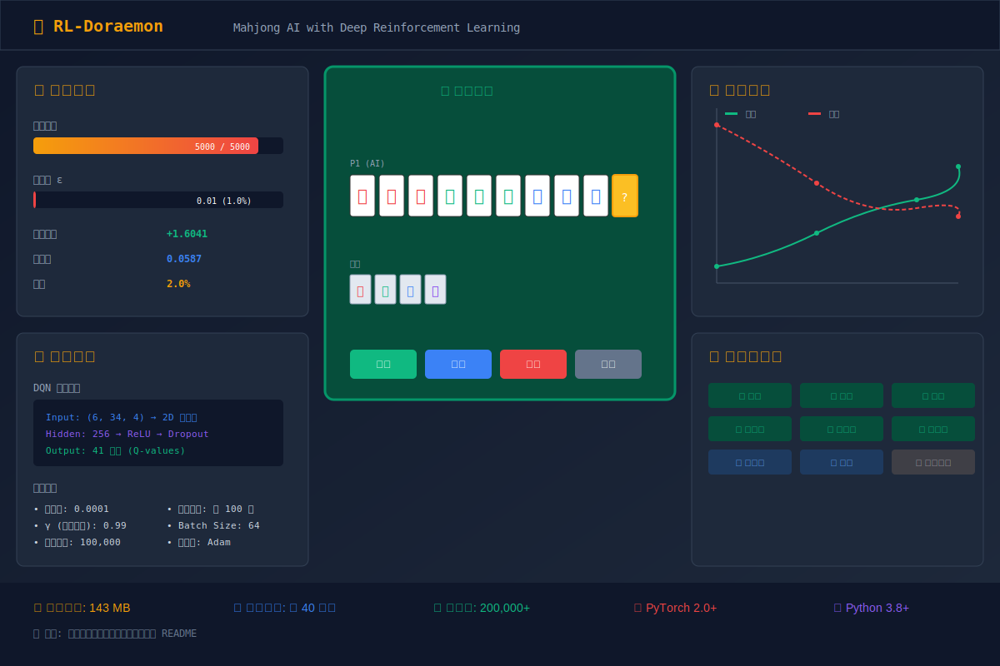

# RL-Doraemon: 麻将AI强化学习项目

<p align="center">
  
  
  
  
  
</p>

<p align="center">
  
  
  
</p>

一个基于深度强化学习（DQN）的麻将AI项目，使用 PyTorch 实现。

## 🖼️ 项目预览

<p align="center">
  
</p>

## 项目简介

本项目实现了一个能够自主学习打麻将的 AI 智能体，通过深度强化学习算法（DQN）进行训练。

### 主要特性：

- 🎮 完整的麻将游戏环境实现
- 🧠 基于 DQN 的强化学习算法
- 📊 详细的训练统计和日志系统
- 📈 收敛检测和可视化工具
- 🔄 检查点自动保存和恢复
- 🎯 信号处理支持（手动保存、优雅退出

## 项目结构

```
rl-doraemon/
├── src/
│   ├── agents/          # 智能体实现
│   │   ├── dqn_agent.py      # DQN 智能体
│   │   ├── random_agent.py   # 随机策略智能体
│   │   └── base_agent.py     # 基础智能体接口
│   ├── environment/     # 麻将游戏环境
│   │   ├── mahjong_env.py    # 麻将环境
│   │   └── rules.py         # 麻将规则
│   ├── models/        # 神经网络模型
│   │   └── dqn_model.py     # DQN 网络
│   ├── training/      # 训练器
│   │   └── trainer.py       # 训练管理器
│   └── utils/         # 工具函数
├── examples/         # 示例脚本
├── tests/            # 测试文件
├── charts/           # 生成的图表
├── checkpoints_*/    # 模型检查点（本地，不提交到 GitHub）
└── logs_*/          # 训练日志（本地，不提交到 GitHub）
```

## 安装和运行

### 环境要求

- Python 3.8+
- PyTorch 2.0+
- 其他依赖见 requirements.txt

### 安装依赖

```bash
pip install -r requirements.txt
```

### 训练模型

#### 2000 回合训练

```bash
python train_2000_episodes.py
```

#### 5000 回合训练

```bash
python train_5000_episodes.py
```

#### 从检查点恢复训练

```bash
python train_5000_episodes.py --resume
```

### 训练参数

```bash
python train_5000_episodes.py [选项]

选项:
  --resume                    从最新检查点恢复训练
  --checkpoint PATH           指定检查点路径
  --start-episode N         起始回合号
  --episodes N              总回合数（默认5000）
  --save-freq N             检查点保存频率（默认50回合）
  --snapshot-freq N         快照保存频率（默认50回合）
  --max-snapshots N         保留的快照数量（默认10）
```

### 信号控制

训练过程中可以使用以下信号：

```bash
# 手动保存快照
kill -SIGUSR1 <PID>

# 优雅退出（保存后退出）
kill -SIGTERM <PID>

# 或按 Ctrl+C
```

<!-- TRAINING_STATUS_START -->
## 训练状态

> 最后更新: 2026-05-28 12:24:08

### ⏸️ 训练已暂停/完成

#### DQN 2000 回合

**训练进度**: [██████░░░░░░░░░░░░░░] 34.9%
- 当前回合: 699 / 2000
- 最新检查点: checkpoint_699_20260526_225622_agent0.pt
- 检查点大小: 142.91 MB
- 最后更新: 2026-05-26 22:56:23

**模型状态**: ✅ 已完成
- 模型文件: `final_model_20260522_152402_agent0.pt`
- 文件大小: 142.91 MB
- 创建时间: 2026-05-22 15:24:02

---

#### DQN 5000 回合

**训练进度**: [███████████████████░] 100.0%
- 当前回合: 4999 / 5000
- 最新检查点: checkpoint_4999_20260525_195410_agent0.pt
- 检查点大小: 142.91 MB
- 最后更新: 2026-05-25 19:54:10

**模型状态**: ✅ 已完成
- 模型文件: `final_model_20260525_195414_agent0.pt`
- 文件大小: 142.91 MB
- 创建时间: 2026-05-25 19:54:15

---

### 📁 模型文件位置

| 模型 | 目录 | 状态 |
|------|------|------|
| DQN 2000 回合 | `checkpoints_2000` | ✅ 已完成 |
| DQN 5000 回合 | `checkpoints_5000` | ✅ 已完成 |

---

### 📜 训练历史说明

#### DQN 2000 回合训练历史

| 日期 | 事件 | 结果 | 日志文件 |
|------|------|------|----------|
| **2026-05-21** | 第一次训练 | ⏸️ 第 226 回合收到 SIGTERM 信号，优雅退出 | `training_20260521_211052.log` |
| **2026-05-22** | 第二次训练 | ✅ **成功完成 2000 回合训练！** 生成最终模型 | `training_20260521_223417.log` |
| **2026-05-26** | 第三次训练 | ⏸️ 第 699 回合中断 | `training_history_20260526_225622.json` |

> **注意**：2000 回合的训练实际上已经在 2026-05-22 完成，模型文件 `final_model_20260522_152402_agent0.pt` 可以直接使用。5月26日是尝试新的训练，但中途中断了。

#### DQN 5000 回合训练历史

| 日期 | 事件 | 结果 | 日志文件 |
|------|------|------|----------|
| **2026-05-25** | 训练完成 | ✅ **成功完成 5000 回合训练！** | `training_5000_20260522_163936.log` |

---

### 📂 训练日志说明

#### 日志目录结构

```
rl-doraemon/
├── logs_2000/         # 2000 回合训练历史 JSON 文件
├── logs_5000/         # 5000 回合训练历史 JSON 文件
├── logs_debug/        # 调试日志
├── logs_high_reward/  # 高奖励训练日志
├── logs_realtime/     # 实时训练日志
├── logs_v2/           # 第2版训练日志
├── logs_v3/           # 第3版训练日志
├── training_*.log     # 完整训练文本日志
└── monitor_*.log      # 监控日志
```

#### 日志文件类型

| 文件类型 | 格式 | 内容说明 |
|---------|------|---------|
| `training_history_*.json` | JSON | 详细训练历史记录，包括每步状态、动作、奖励 |
| `training_*.log` | 文本 | 训练过程文本日志，包括损失、奖励统计 |
| `convergence_log_*.json` | JSON | 收敛性检测日志 |

#### 更新训练状态

使用以下脚本自动更新 README 中的训练状态：

```bash
# 只显示状态，不更新 README
python update_readme_status.py --print-only

# 显示状态并更新 README
python update_readme_status.py --update-readme

# 持续监控模式（每分钟自动更新）
python update_readme_status.py --watch --update-readme --interval 60
```

<!-- TRAINING_STATUS_END -->

## 模型文件说明

由于模型文件较大（每个约 143MB），**不包含在 GitHub 仓库中**。你可以通过以下方式获取模型：

### 选项 1：下载预训练模型（推荐）

我们提供了预训练模型的云存储下载链接：

| 模型 | 训练回合 | 文件大小 | 下载链接 |
|------|----------|----------|----------|
| DQN 2000 回合 | 2000 回合 | 143 MB | [Google Drive 文件夹](https://drive.google.com/drive/folders/1_Cw0NhlSoCk_7oFGhWa5oRwVyAluudru?usp=sharing) |
| DQN 5000 回合 | 5000 回合 | 143 MB | [Google Drive 文件夹](https://drive.google.com/drive/folders/1KQi2fw8FxHvUgDcUjTep2TPz740jApy1?usp=sharing) |

> **注意**：模型文件将上传到上述 Google Drive 文件夹中。上传完成后，点击链接进入文件夹下载模型文件。

#### 下载步骤：

1. 点击上方的下载链接
2. 下载模型文件到本地
3. 将文件放置到对应的目录：

```bash
# 2000 回合模型
mkdir -p checkpoints_2000
mv final_model_2000_*.pt checkpoints_2000/

# 5000 回合模型
mkdir -p checkpoints_5000
mv final_model_5000_*.pt checkpoints_5000/
```

### 选项 2：自己训练模型

如果你想从头开始训练模型：

```bash
# 训练 2000 回合（约 16 小时）
python train_2000_episodes.py

# 或训练 5000 回合（约 40 小时）
python train_5000_episodes.py
```

### 选项 3：从检查点恢复训练

如果你有之前的检查点文件：

```bash
# 从最新检查点恢复
python train_5000_episodes.py --resume

# 或指定检查点路径
python train_5000_episodes.py --checkpoint ./checkpoints_5000/checkpoint_2999_*.pt
```

### 模型文件位置

训练完成或下载后，模型文件结构如下：

```
checkpoints_2000/
├── final_model_*.pt           # 2000回合最终模型（143MB）
├── checkpoint_*.pt              # 中间检查点
└── snapshots/               # 回合快照

checkpoints_5000/
├── final_model_*.pt           # 5000回合最终模型（143MB）
├── checkpoint_*.pt              # 中间检查点
└── snapshots/               # 回合快照
```

### 上传模型到云存储的步骤

如果你想分享自己训练的模型：

#### Google Drive：

1. 上传模型文件到 Google Drive
2. 右键点击文件 → 共享 → 复制链接
3. 确保链接权限设置为"任何知道链接的人都可以查看"
4. 将链接添加到上方表格

#### 百度网盘：

1. 上传模型文件到百度网盘
2. 右键点击文件 → 分享 → 创建公开链接
3. 复制分享链接和提取码
4. 将链接添加到上方表格

#### Dropbox / OneDrive：

类似步骤，创建公开分享链接即可。

## 加载和使用模型

### 加载训练好的模型

```python
from src.agents.dqn_agent import DQNAgent

# 创建智能体
agent = DQNAgent(
    name="DQN_Mahjong",
    input_shape=(6, 34, 4),
    num_actions=41,
    hidden_size=256,
    epsilon_start=0.01,  # 评估时使用低探索率
    epsilon_end=0.01
)

# 加载模型
agent.load("./checkpoints_5000/final_model_xxx_agent0.pt")

# 设置为评估模式
agent.set_training(False)
```

### 评估模型

```bash
# 自动评估最新模型
python evaluate_final_model.py --compare

# 指定模型文件
python evaluate_final_model.py --model ./checkpoints_5000/final_model_xxx_agent0.pt

# 自定义测试回合数
python evaluate_final_model.py --episodes 200 --compare
```

### 使用模型对比

```bash
python compare_models.py
```

## 可视化训练曲线

```bash
# 绘制训练曲线
python plot_training_curves.py

# 绘制收敛曲线
python plot_convergence_curves.py
```

## 训练统计

### 2000 回合训练结果

| 指标 | 数值 |
|------|------|
| 总步数 | 184,920 |
| 最终探索率 | 1.0% |
| 胜率 | 2.0% |
| 平均奖励 | 1.6041 |

### 5000 回合训练结果

| 指标 | 数值 |
|------|------|
| 总步数 | 200,000+ |
| 最终探索率 | 1.0% |
| 损失稳定 | 0.05-0.07 |

## 开发和牌记录

训练过程中，模型学会了：

- ✅ 立直 (Riichi)
- ✅ 自摸 (Tsumo)
- ✅ 荣和 (Ron)
- ✅ 清一色 (Chinitsu)
- ✅ 七对子 (Chiitoitsu)
- ✅ 一杯口 (Iipeikou)

## 调试工具

项目包含多个调试工具：

```bash
# 调试游戏流程
python debug_game_flow.py

# 调试和牌检测
python debug_win_detection.py

# 调试役种检测
python debug_yaku.py

# 测试模型和牌能力
python test_win_detection.py
```

## 训练后自动评估

```bash
# 训练完成后自动评估
python auto_train_evaluate.py

# 只监控现有训练进程
python auto_train_evaluate.py --monitor-only
```

## 许可证

MIT License

## 贡献

欢迎提交 Issue 和 Pull Request！

## 联系方式

如有问题，请提交 GitHub Issue。

---

**注意**: 模型文件和训练日志由于体积较大，未包含在 GitHub 仓库中。请按照上述说明自行训练或下载预训练模型。
